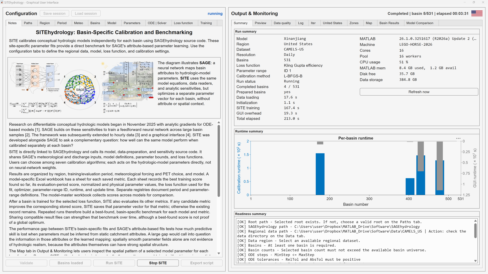
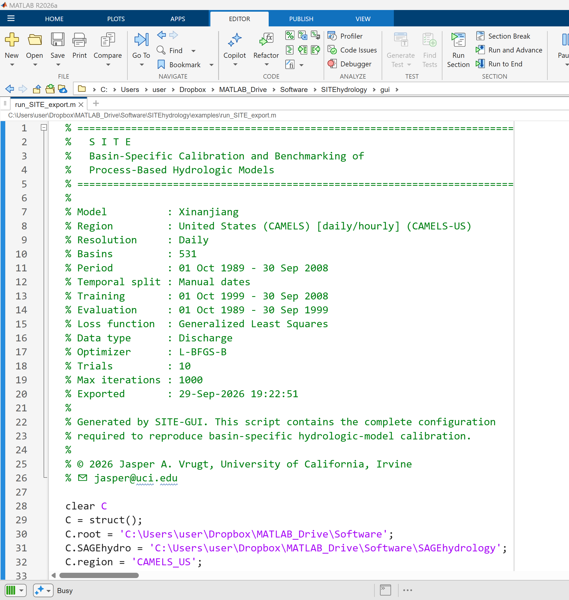
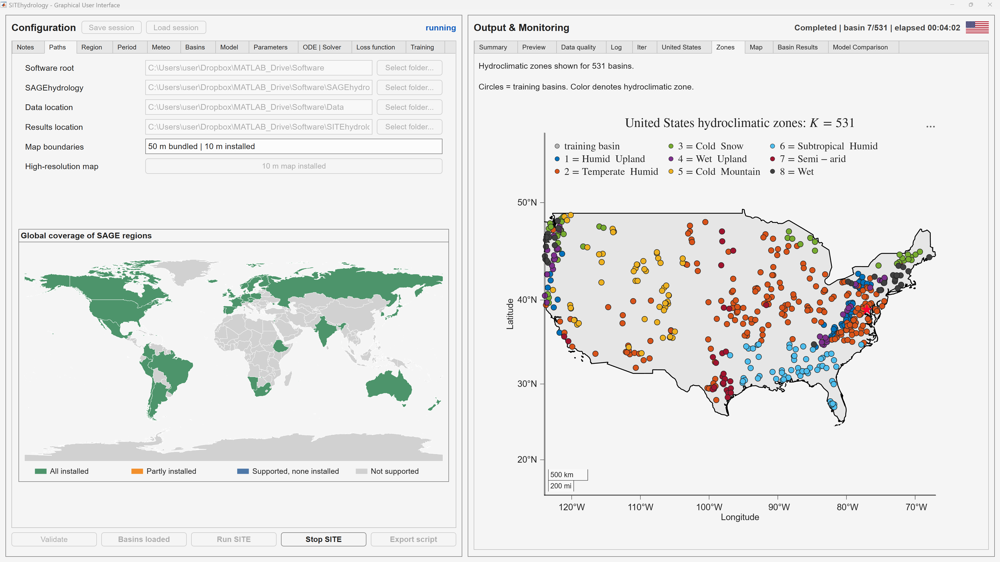
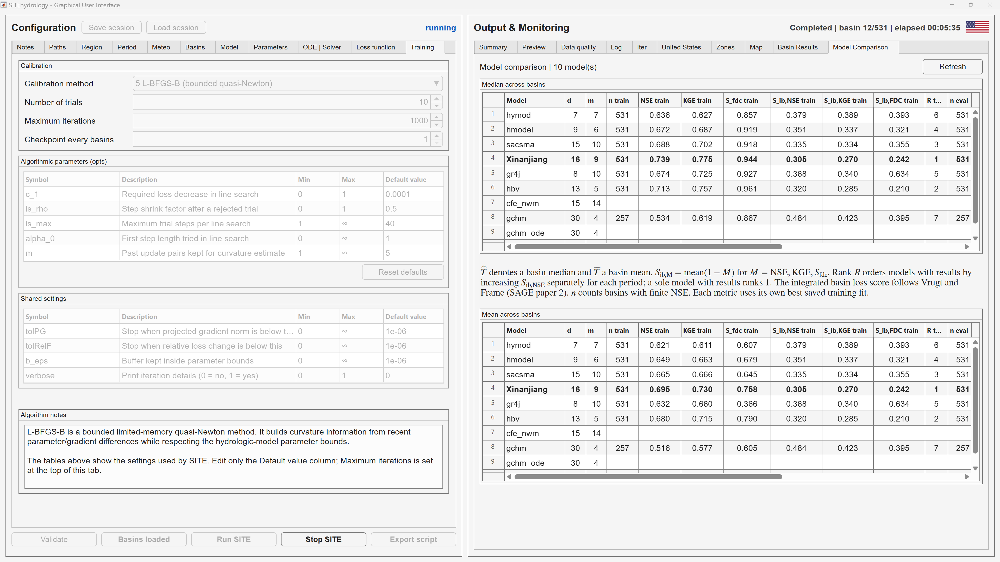

# SITEhydrology

Site-specific Inference and Training Engine (SITE) calibrates conceptual
hydrologic models independently for individual basins. It uses the model,
data-reading, sensitivity, and diagnostic infrastructure provided by
[SAGEhydrology](https://github.com/jaspervrugt/SAGEhydrology), while optimizing
a separate parameter vector for each basin rather than learning parameters
from static basin attributes.



The graphical interface combines configuration, live calibration progress,
runtime diagnostics, readiness checks, and basin-level results in a single
workspace.

This repository contains the public computational source for SITEhydrology.
The graphical user interface is distributed separately as a compiled
application; its source code is not part of this repository.

## Repository contents

```text
examples/demo_SITE.mlx   Illustrated SITE Live Script
results/                 Basin-specific benchmark workbooks and checkpoints
src/                     SITE calibration and execution routines
utils/                   Optimizers and result-management utilities
```

Raw hydrologic and meteorological datasets, caches, generated exports, and GUI
source files are intentionally excluded.

## Installation

### MATLAB source

1. Clone or download both `SITEhydrology` and
   [SAGEhydrology](https://github.com/jaspervrugt/SAGEhydrology) into the same
   parent directory.
2. Place the regional hydrologic and meteorological datasets in the `Data/`
   directory used by SAGEhydrology, or install them with the compiled GUI.
3. Open `examples/demo_SITE.mlx`, select a model and optional basin subset,
   and review the configuration before running it.
4. Compile any platform-specific SAGEhydrology MEX kernels required by the
   selected model and execution backend.

SITE configurations can also be exported as ordinary MATLAB scripts. The
export records the selected model, region, data resolution, periods, loss
function, optimizer, and numerical settings for reproducible source-based
execution.



A typical workspace is:

```text
Software/
|-- Data/
|-- SAGEhydrology/
`-- SITEhydrology/
```

### Compiled graphical application

Compiled SITE GUI applications are distributed through the GitHub Releases
page. They are separately licensed and are not covered by the BSD license for
the public computational source.

The GUI uses the regional data infrastructure provided by SAGEhydrology. It
shows installed and supported regions, local data availability, and the
hydroclimatic organization of the selected basin collection.



## Results

The `results/` directory contains versioned SITE benchmark workbooks and
checkpoint files. Parameter workbooks retain basin-specific best scores,
parameter vectors, update times, and completed-run counts. Model-master
workbooks collect the basin scores used for comparison across hydrologic
models. SITE updates a stored result only when a new run improves the
corresponding metric.

SITE can compare the basin-wise performance of multiple conceptual models
while a calibration is running. Median and mean summaries report predictive
scores, integrated basin losses, parameter dimensions, and the number of
basins represented by each saved benchmark.



The current JKGE columns use the default definition: `M = 2`, moving-average
mean benchmark operator, and a 31-day window. Runs using other JKGE settings
do not overwrite those columns.

The software does not bundle or redistribute CAMELS or other regional input
datasets. Dataset use remains subject to each provider's availability,
citation requirements, and license.

## Citation

Please cite SITEhydrology using `CITATION.cff` and cite SAGEhydrology and the
relevant hydrologic-model and dataset publications used in an analysis.

## Licensing

The computational source in this repository is licensed under the BSD
3-Clause License; see `LICENSE`.

Compiled SITE GUI applications are separately licensed and are not covered by
the repository's BSD license. MATLAB Runtime, SAGEhydrology, and third-party
datasets and assets remain subject to their respective licenses.

## Contact

Jasper A. Vrugt  
University of California, Irvine  
jasper@uci.edu
